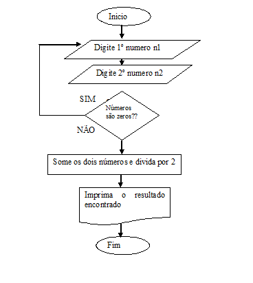

#### Simbologia do Diagrama de Bloco

Podemos ver na imagem que tem simbolos para indicar o início e o fim do procesamento, o processamento, a entrada de dados através do teclado, decisão,e exebição.
 