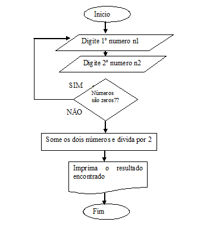

#### Exemplos de Diagrama de Bloco

Entender o conceito é importante para o entendimento. 

Numa reunião, quando colocados coisas complexas num diagrama, fica tudo mais fácil de entender e programar.

Importante desenhar os processos em diagramas.
